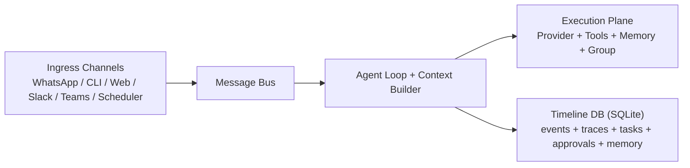

# KafClaw System Architecture — Detailed Reference

> For the quick overview, see [architecture.md](./architecture/).
> See also: FR-009 System Architecture, FR-013 Package Design, FR-018 Interface Contracts

---

## Table of Contents

1. [Overview](#1-overview)
2. [Directory Structure](#2-directory-structure)
3. [Startup Sequence](#3-startup-sequence)
4. [Message Processing Pipeline](#4-message-processing-pipeline)
5. [Package Architecture](#5-package-architecture)
6. [Memory Architecture](#6-memory-architecture)
7. [API Endpoints](#7-api-endpoints)
8. [Electron Desktop Application](#8-electron-desktop-application)
9. [Security Model](#9-security-model)
10. [Deployment Modes](#10-deployment-modes)
11. [Build and Release](#11-build-and-release)
12. [Data Flow Diagrams](#12-data-flow-diagrams)
13. [Extension Points](#13-extension-points)

---

## 1. Overview

KafClaw is a personal AI assistant framework written in Go with an Electron desktop frontend. It connects messaging channels (WhatsApp, local network, web UI) to LLM providers through an asynchronous message bus, with a tool registry for filesystem/shell/web operations, a 6-layer semantic memory system, policy-based authorization, multi-agent collaboration via Kafka, and a cron-based job scheduler.

<div style="overflow:auto;border:1px solid #d4dcec;border-radius:10px;padding:10px;background:#fbfdff;">
  <svg viewBox="0 0 1120 340" role="img" aria-label="KafClaw detailed architecture overview diagram" style="min-width:900px;max-width:100%;height:auto;">
    <defs>
      <marker id="arrowB" markerWidth="9" markerHeight="7" refX="8" refY="3.5" orient="auto">
        <polygon points="0 0, 9 3.5, 0 7" fill="#2e5cab"></polygon>
      </marker>
    </defs>
    <rect x="400" y="28" width="320" height="70" rx="10" fill="#eaf1ff" stroke="#9bb5e6"></rect>
    <text x="560" y="56" text-anchor="middle" font-size="17" font-weight="700" fill="#1f3f84">Message Bus</text>
    <text x="560" y="76" text-anchor="middle" font-size="12" fill="#355d9c">decouples channels from agent loop</text>

    <rect x="400" y="120" width="320" height="72" rx="10" fill="#ffffff" stroke="#d4dcec"></rect>
    <text x="560" y="148" text-anchor="middle" font-size="16" font-weight="700" fill="#24344d">Agent Loop + Context Builder</text>
    <text x="560" y="168" text-anchor="middle" font-size="12" fill="#4e5c73">soul files • memory • skills • tool calls</text>

    <rect x="90" y="44" width="230" height="148" rx="10" fill="#ffffff" stroke="#d4dcec"></rect>
    <text x="205" y="68" text-anchor="middle" font-size="14" font-weight="700" fill="#24344d">Ingress Channels</text>
    <text x="205" y="92" text-anchor="middle" font-size="12" fill="#4e5c73">WhatsApp / CLI / Web</text>
    <text x="205" y="112" text-anchor="middle" font-size="12" fill="#4e5c73">Slack / Teams bridge</text>
    <text x="205" y="132" text-anchor="middle" font-size="12" fill="#4e5c73">Scheduler jobs</text>
    <text x="205" y="152" text-anchor="middle" font-size="12" fill="#4e5c73">Group traces/tasks</text>

    <rect x="800" y="44" width="230" height="148" rx="10" fill="#ffffff" stroke="#d4dcec"></rect>
    <text x="915" y="68" text-anchor="middle" font-size="14" font-weight="700" fill="#24344d">Execution Plane</text>
    <text x="915" y="92" text-anchor="middle" font-size="12" fill="#4e5c73">Provider (LLM)</text>
    <text x="915" y="112" text-anchor="middle" font-size="12" fill="#4e5c73">Tools (fs/shell/web)</text>
    <text x="915" y="132" text-anchor="middle" font-size="12" fill="#4e5c73">Memory (RAG/observer)</text>
    <text x="915" y="152" text-anchor="middle" font-size="12" fill="#4e5c73">Group + Orchestrator</text>

    <rect x="320" y="226" width="480" height="82" rx="10" fill="#f4f8ff" stroke="#c8d6f1"></rect>
    <text x="560" y="249" text-anchor="middle" font-size="14" font-weight="700" fill="#214483">Timeline DB (SQLite)</text>
    <text x="560" y="269" text-anchor="middle" font-size="12" fill="#4e5c73">events • traces • tasks • approvals • memory chunks</text>
    <text x="560" y="287" text-anchor="middle" font-size="12" fill="#4e5c73">settings • roster • topic metadata</text>

    <line x1="320" y1="92" x2="400" y2="62" stroke="#2e5cab" stroke-width="2.2" marker-end="url(#arrowB)"></line>
    <line x1="720" y1="62" x2="800" y2="92" stroke="#2e5cab" stroke-width="2.2" marker-end="url(#arrowB)"></line>
    <line x1="560" y1="98" x2="560" y2="120" stroke="#2e5cab" stroke-width="2.2" marker-end="url(#arrowB)"></line>
    <line x1="560" y1="192" x2="560" y2="226" stroke="#2e5cab" stroke-width="2.2" marker-end="url(#arrowB)"></line>
  </svg>
</div>

Mermaid source (GitHub code view renders this; GitHub Pages may require a Mermaid JS include depending on your theme setup):



### Design Principles

- **Message bus decoupling** — Channels never call the agent directly
- **Graceful degradation** — Memory, group, orchestrator, ER1 are all optional
- **Secure defaults** — Binds 127.0.0.1, tier-restricted tools, deny-pattern filtering
- **Single SQLite database** — All persistent state in `~/.kafclaw/timeline.db`

---

## 2. Directory Structure

```
kafclaw/
+-- internal/cli/              # CLI commands (Cobra)
|   +-- root.go                   # Root command, version
|   +-- gateway.go                # Main daemon (all API endpoints)
|   +-- agent.go                  # Single-message CLI mode
|   +-- onboard.go                # First-time setup wizard
|   +-- status.go                 # Config/key/session health check
|   +-- group.go                  # Group collaboration CLI
|   +-- kshark.go                 # Kafka diagnostics
|   +-- install.go                # System install (/usr/local/bin)
|   +-- whatsapp_*.go             # WhatsApp setup and auth
|
+-- internal/
|   +-- agent/                    # Core agent loop + context builder
|   +-- approval/                 # Interactive tool approval workflow
|   +-- bus/                      # Async message bus (pub-sub)
|   +-- channels/                 # External integrations (WhatsApp)
|   +-- config/                   # Configuration (env/file/defaults)
|   +-- cron/                     # Cron expression parser
|   +-- group/                    # Multi-agent collaboration (Kafka)
|   +-- kshark/                   # Kafka diagnostics library
|   +-- memory/                   # 6-layer semantic memory system
|   +-- orchestrator/             # Agent hierarchy and zones
|   +-- policy/                   # Tiered tool authorization
|   +-- provider/                 # LLM abstraction (OpenAI, OpenRouter, Whisper)
|   +-- scheduler/                # Cron-based job scheduling
|   +-- session/                  # JSONL conversation persistence
|   +-- timeline/                 # SQLite event log + schema
|   +-- tools/                    # Tool registry + implementations
|   +-- util/                     # Shared utilities
|
+-- electron/                     # Electron desktop application
|   +-- src/main/                 # Main process (sidecar, IPC, menus)
|   +-- src/preload/              # Context-isolated bridge
|   +-- src/renderer/             # Vue 3 SPA (Pinia, Vite)
|       +-- stores/               # agent, memory, orchestrator, mode, remote
|       +-- views/                # Dashboard, Memory, Orchestrator, Settings
|       +-- components/           # MemoryPipeline, HierarchyGraph, etc.
|       +-- composables/          # useApi, useSidecar
|
+-- web/                          # Go-served HTML dashboards
+-- operations/                   # Day-to-day task templates
+-- Makefile                      # Build/run/release targets
+-- go.mod                        # Go 1.24.0
+-- Dockerfile / docker-compose   # Container deployment
```

---

## 3. Startup Sequence (Gateway)

The gateway command initializes all subsystems in dependency order:

```
 1. Load Config          (env > ~/.kafclaw/config.json > defaults)
 2. Open Timeline DB     (~/.kafclaw/timeline.db, schema migration)
 3. Seed Settings        (bot_repo_path, work_repo_path, lfs_proxy_url)
 4. Create Message Bus   (100-msg inbound/outbound buffers)
 5. Initialize Provider  (OpenAI + optional LocalWhisper wrapper)
 6. Create Policy Engine (MaxAutoTier=2 internal, ExternalMaxTier=0)
 7. Setup Memory System
    a. SQLiteVecStore    (1536-dim embeddings in timeline.db)
    b. MemoryService     (embed + upsert + search)
    c. AutoIndexer       (background batch indexer)
    d. ExpertiseTracker  (skill proficiency)
    e. WorkingMemoryStore(per-user/thread scratchpads)
    f. Observer          (LLM conversation compression)
    g. ER1Client         (personal memory sync)
    h. LifecycleManager  (TTL pruning, daily)
 8. Setup Group (optional: Kafka consumer, group manager, router)
 9. Setup Orchestrator   (optional: hierarchy, zones, discovery)
10. Create Agent Loop    (wires bus, provider, memory, policy, tools)
11. Index Soul Files     (background: AGENTS.md, SOUL.md, etc.)
12. Start Channels       (WhatsApp via whatsmeow)
13. Start HTTP Servers
    a. API server        (port 18790: /chat endpoint)
    b. Dashboard server  (port 18791: REST API + web UI)
14. Start Background Workers
    a. AutoIndexer       (goroutine)
    b. ER1 SyncLoop      (goroutine, every 5min)
    c. LifecycleManager  (goroutine, daily)
    d. Scheduler         (goroutine, if enabled)
    e. Bus Dispatcher    (goroutine)
    f. Delivery Worker   (goroutine)
15. Start Agent Loop     (goroutine, consumes from bus)
16. Start Orchestrator   (goroutine, if enabled)
17. Start Group Router   (goroutine, Kafka consumer)
18. Wait for SIGINT/SIGTERM
```

---

## 4. Message Processing Pipeline

### 4.1 Inbound Flow

```
Channel receives message
    |
    v
Message Bus (PublishInbound)
    |
    v
Agent Loop (ConsumeInbound)
    |
    +-- Dedup via IdempotencyKey
    +-- Create timeline task (pending)
    +-- Detect Day2Day commands (dtu/dtp/dts/dtn/dta/dtc)
    +-- Detect attack intent (German + English patterns)
    +-- Intercept approval responses (approve:<id> / deny:<id>)
    |
    v
processMessage()
    |
    +-- Load/create session
    +-- Classify message type (internal vs external)
    |
    v
Context Assembly (ContextBuilder)
    |
    +-- 1. Identity      (version, date, workspace paths)
    +-- 2. Bootstrap      (AGENTS.md, SOUL.md, USER.md, TOOLS.md, IDENTITY.md)
    +-- 3. Working Memory (scoped per user/thread from SQLite)
    +-- 4. Observations   (compressed session history, priority-sorted)
    +-- 5. Skills Summary (registered tools + skill docs)
    +-- 6. RAG Context    (vector search across all 6 memory layers)
    +-- 7. Conversation   (recent message history from session)
         |
         v
    runAgentLoop()
    |
    +-- LLM Call (messages + tool definitions)
    |   |
    |   v
    |  finish_reason == "tool_calls"?
    |   +-- YES: for each tool call:
    |   |   +-- Policy check (tier vs sender vs message type)
    |   |   +-- If RequiresApproval -> approval workflow
    |   |   +-- Execute tool (registry.Execute)
    |   |   +-- Record expertise event
    |   |   +-- Auto-index tool result (if substantive)
    |   |   +-- Add result to messages
    |   |   +-- Loop back to LLM Call
    |   +-- NO: return final response
    |
    v
Post-Processing
    |
    +-- Save to session (JSONL)
    +-- Auto-index conversation pair
    +-- Enqueue messages for observer
    +-- Update working memory (if agent called update_working_memory)
    +-- Track expertise (task completion)
    +-- Publish group trace (if group enabled)
    +-- Publish outbound response
         |
         v
    Message Bus (PublishOutbound)
         |
         v
    Channel.Send() (WhatsApp, web UI, etc.)
```

### 4.2 Message Classification

| Type | Source | Max Auto Tier | Access Level |
|------|--------|---------------|-------------|
| `internal` | Owner (allowlist, CLI, scheduler) | 2 (shell) | Full |
| `external` | Non-owner (unknown sender) | 0 (read-only) | Restricted |

---

## 5. Package Architecture

### 5.1 internal/agent — Core Loop

**Files:** `loop.go`, `context.go`, `delivery.go`

`LoopOptions` wires all dependencies:

```go
type LoopOptions struct {
    Bus              *bus.MessageBus
    Provider         provider.LLMProvider
    Timeline         *timeline.TimelineService
    Policy           policy.Engine
    MemoryService    *memory.MemoryService
    AutoIndexer      *memory.AutoIndexer
    ExpertiseTracker *memory.ExpertiseTracker
    WorkingMemory    *memory.WorkingMemoryStore
    Observer         *memory.Observer
    GroupPublisher   GroupTracePublisher
    Workspace, WorkRepo, SystemRepo string
    WorkRepoGetter   func() string
    Model            string
    MaxIterations    int   // default: 20
}
```

**ContextBuilder** assembles the system prompt:
- `BuildSystemPrompt()` — Identity + bootstrap files + skills
- `BuildMessages()` — Constructs message list with history
- `AssessTask()` — Lightweight classification (security/creative/architecture/bug-fix/quick-answer)
- `BuildIdentityEnvelope()` — AgentIdentity for group collaboration

**Day2Day Task Manager** — `dtu`, `dtp`, `dts`, `dtn`, `dta`, `dtc` commands for daily task tracking. Stores tasks in workspace markdown with checkbox format.

### 5.2 internal/bus — Message Bus

Async pub-sub decoupling channels from the agent loop.

```go
type InboundMessage struct {
    Channel, SenderID, ChatID, TraceID string
    IdempotencyKey string
    Content        string
    Media          []byte
    Metadata       map[string]string  // includes "message_type"
    Timestamp      time.Time
}
```

- Buffered channels: 100 inbound, 100 outbound
- `Subscribe(channel, callback)` — channels register for outbound delivery
- `DispatchOutbound()` — goroutine, fans out to subscribers

### 5.3 internal/channels — External Integrations

```go
type Channel interface {
    Name() string
    Start(ctx context.Context) error
    Stop() error
    Send(ctx context.Context, msg *OutboundMessage) error
}
```

**WhatsApp** (via whatsmeow — native Go, no Node bridge):
- Session: `~/.kafclaw/whatsapp.db`
- JID normalization, audio transcription (Whisper), image handling
- Config: enabled, allowFrom, dropUnauthorized, ignoreReactions

### 5.4 internal/config — Configuration

Loading precedence: `KAFCLAW_*` env vars > `~/.kafclaw/config.json` > defaults.

Runtime settings in SQLite override config for: `work_repo_path`, `bot_repo_path`, `group_name`, `group_active`, `kafscale_lfs_proxy_url`.

### 5.5 internal/provider — LLM Abstraction

```go
type LLMProvider interface {
    Chat(ctx, *ChatRequest) (*ChatResponse, error)
    Transcribe(ctx, *AudioRequest) (*AudioResponse, error)
    Speak(ctx, *TTSRequest) (*TTSResponse, error)
    DefaultModel() string
}

type Embedder interface {
    Embed(ctx, *EmbeddingRequest) (*EmbeddingResponse, error)
}
```

- **OpenAI provider** — Chat + embeddings + TTS. Custom apiBase for OpenRouter/DeepSeek.
- **LocalWhisper provider** — Wraps OpenAI, runs Whisper binary locally for transcription.

### 5.6 internal/tools — Tool Registry

```go
type Tool interface {
    Name() string
    Description() string
    Parameters() map[string]any  // JSON Schema
    Execute(ctx, params map[string]any) (string, error)
}

type TieredTool interface {
    Tool
    Tier() int  // 0=read-only, 1=write, 2=high-risk
}
```

Default tools:

| Tool | Tier | Description |
|------|------|-------------|
| `read_file` | 0 | Read file contents |
| `write_file` | 1 | Write to work repo |
| `edit_file` | 1 | Replace text in file |
| `list_dir` | 0 | List directory contents |
| `resolve_path` | 0 | Resolve workspace paths |
| `exec` | 2 | Shell execution (filtered, timeout 60s) |
| `remember` | 1 | Store to semantic memory |
| `recall` | 1 | Search semantic memory |
| `update_working_memory` | 1 | Update per-user scratchpad |

### 5.7 internal/policy — Authorization Engine

```go
type Engine interface {
    Evaluate(ctx Context) Decision
}

type Decision struct {
    Allow            bool
    RequiresApproval bool
    Reason           string
    Tier             int
}
```

### 5.8 internal/approval — Approval Workflow

Interactive approval gates for high-tier tool calls:
1. Policy returns `RequiresApproval=true`
2. Pending approval stored, prompt broadcast to user
3. User responds `approve:<id>` or `deny:<id>`
4. Waiting goroutine unblocked
5. Tool execution proceeds or aborts

### 5.9 internal/session — Conversation State

JSONL-based at `~/.kafclaw/sessions/{key}.jsonl`:
- Line 1: metadata JSON
- Lines 2+: message objects (role, content, timestamp)

Thread-safe with in-memory caching.

### 5.10 internal/timeline — SQLite Event Log

Central persistence. Schema includes:

**Core:** `timeline`, `settings`, `tasks`, `web_users`, `web_links`, `policy_decisions`, `approval_requests`, `scheduled_jobs`

**Memory:** `memory_chunks`, `working_memory`, `observations`, `observations_queue`, `agent_expertise`, `skill_events`

**Group:** `group_members`, `group_membership_history`, `group_tasks`, `group_traces`, `group_memory_items`, `group_skill_channels`, `topic_message_log`, `delegation_events`

**Orchestrator:** `orchestrator_zones`, `orchestrator_zone_members`, `orchestrator_hierarchy`

### 5.11 internal/scheduler — Job Scheduling

Cron-based with distributed file locking:
- Ticks every `TickInterval` (default 60s)
- Per-category semaphores: LLM (3), shell (1), default (5)
- Jobs published to bus as `scheduler:` channel messages

### 5.12 internal/group — Multi-Agent Collaboration

Kafka-based distributed agent coordination.

**Topics** (per group): `group.{name}.announce`, `.requests`, `.responses`, `.traces`

**Envelope types:** announce, request, response, trace, heartbeat, onboard, memory, skill_request, skill_response, audit, task_status, roster

**Components:** Manager, KafkaConsumer, GroupRouter, SkillChannelRegistry, OnboardingProtocol

**LFS integration:** Large artifact storage via KafScale LFS proxy (HTTP, SASL/PLAIN auth).

### 5.13 internal/orchestrator — Hierarchy and Zones

Multi-agent hierarchies:
- `AgentNode` — role, parent_id, zone_id, endpoint, status
- `Zone` — visibility (private/shared/public), owner, parent
- Discovery via Kafka topic
- Stored in `orchestrator_hierarchy` and `orchestrator_zones`

---

## 6. Memory Architecture

> See also: FR-019 Memory Architecture, FR-021 Memory v2 Implementation Plan

### 6.1 Layer Overview

| Layer | Source Prefix | TTL | Description |
|-------|--------------|-----|-------------|
| Soul | `soul:` | Permanent | Identity files loaded at startup |
| Conversation | `conversation:` | 30 days | Auto-indexed Q&A pairs |
| Tool | `tool:` | 14 days | Tool execution outputs |
| Group | `group:` | 60 days | Shared via Kafka/LFS |
| ER1 | `er1:` | Permanent | Personal memory sync |
| Observation | `observation:` | Permanent | LLM-compressed observations |

### 6.2 Components

- **MemoryService** — Store/Search with auto-embedding. Graceful degradation if no embedder.
- **SQLiteVecStore** — Embedded vector DB. 1536-dim embeddings as float32 BLOBs. Cosine similarity in Go (<1ms at <10K chunks). Deterministic chunk IDs via SHA-256.
- **AutoIndexer** — Non-blocking enqueue (100-item buffer), 5-item/30s flush. Skips greetings, short content, raw JSON.
- **SoulFileIndexer** — Chunks files by `##` headers. Idempotent via deterministic IDs.
- **Observer** — Message threshold (default 50) triggers LLM compression. Produces HIGH/MEDIUM/LOW observations. Reflector consolidates at max (default 200).
- **WorkingMemoryStore** — Keyed by (resourceID, threadID). Thread falls back to resource-level.
- **ER1Client** — Auth via `/user/access`, fetch via `/memory/{ctx_id}`, sync every 5 minutes.
- **ExpertiseTracker** — Per-skill proficiency: `0.6*successRate + 0.3*avgQuality + 0.1*experienceBonus`.
- **LifecycleManager** — Daily TTL pruning. Max chunks: 50,000. Manual `Prune()` and `DeleteBySource()`.

### 6.3 Context Assembly Order

```
System Prompt:
  1. Identity           (runtime info, version, date math)
  2. Bootstrap Files    (AGENTS.md, SOUL.md, USER.md, TOOLS.md, IDENTITY.md)
  3. Working Memory     (scoped per user/thread)
  4. Observations       (compressed session history, by date)
  5. Skills Summary     (tool descriptions + skill docs)
  6. RAG Context        (vector search across all 6 layers)
  7. Conversation       (recent message history)
```

Sections 1-4 form a stable prefix for prompt caching.

---

## 7. API Endpoints

### 7.1 API Server (port 18790)

| Method | Path | Description |
|--------|------|-------------|
| POST | `/chat?message=...&session=...` | Process message via agent loop |

### 7.2 Dashboard Server (port 18791)

**Status:** `/api/v1/status`, `/api/v1/auth/verify`

**Timeline:** `/api/v1/timeline`, `/api/v1/trace/{traceID}`, `/api/v1/trace-graph/{traceID}`, `/api/v1/policy-decisions`

**Memory:** `/api/v1/memory/status`, `/api/v1/memory/reset`, `/api/v1/memory/config`, `/api/v1/memory/prune`

**Settings:** `/api/v1/settings`, `/api/v1/workrepo`

**Repository (15 endpoints):** tree, file, status, search, gh-auth, branches, checkout, log, diff, diff-file, commit, pull, push, init, pr

**Orchestrator:** status, hierarchy, zones, agents, dispatch

**Group (20+ endpoints):** status, members, join, leave, tasks, traces, memory, skills, topics, audit

**Web Chat:** `/api/v1/webchat/send`, `/api/v1/webusers`, `/api/v1/weblinks`

**Tasks/Approvals:** `/api/v1/tasks`, `/api/v1/approvals/pending`, `/api/v1/approvals/{id}`

All endpoints set `Access-Control-Allow-Origin: *`. Auth middleware applies when AuthToken configured.

---

## 8. Electron Desktop Application

### Architecture

```
Main Process (Electron)
+-- Sidecar Manager (Go binary lifecycle)
+-- IPC Handlers (mode, config, sidecar, remote)
+-- Menu (Timeline, Group, Change Mode)
+-- Window (sandbox, context isolation)

Preload (context bridge)
+-- electronAPI exposed to renderer

Renderer (Vue 3 SPA)
+-- Stores (Pinia): agent, memory, orchestrator, mode, remote
+-- Views: Dashboard, Memory, Orchestrator, ModePicker, Settings
+-- Components: MemoryPipeline, HierarchyGraph, ZoneTree, AgentCard
+-- Composables: useApi, useSidecar
```

### Operation Modes

| Mode | Sidecar | Group | Network |
|------|---------|-------|---------|
| Standalone | Local Go binary | No | localhost only |
| Full | Local Go binary | Kafka | localhost + Kafka |
| Remote | None | N/A | Remote API URL |

### Header Status Indicators

- **Mode badge** — Current mode (standalone/full/remote)
- **Memory LED** — Circle indicator (purple=healthy, amber=high, red=critical, gray=unavailable). Polls `/api/v1/memory/status` every 30s.
- **Sidecar/Connection** — Process status or remote connection status

---

## 9. Security Model

> See also: [admin-guide.md](./admin-guide.md#2-security-model) for the comprehensive security reference, [security-risks.md](./security-risks/) for threat model

### 9.1 Tool Authorization (3-Tier)

| Tier | Examples | Internal | External |
|------|---------|----------|----------|
| 0 Read-only | read_file, list_dir, recall | Auto-allow | Auto-allow |
| 1 Writes | write_file, edit_file, remember | Auto-allow | Deny |
| 2 High-risk | exec (shell) | Auto-allow | Deny |

### 9.2 Shell Deny Patterns

Destructive deletion, VCS deletion, disk destruction, device redirection, permission escalation, fork bombs, system control.

### 9.3 Network Security

- Default bind: 127.0.0.1
- Headless: 0.0.0.0 with dashboard API auth token (`/api/v1/status` excluded)
- `POST /chat` on port `18790` also enforces bearer auth when `KAFCLAW_GATEWAY_AUTH_TOKEN` is configured
- TLS: optional cert/key
- Electron: sandbox, context isolation, no node integration in renderer

### 9.4 Filesystem Boundaries

- Write tools restricted to work repo via `isWithin()` + `filepath.Rel()`
- Path traversal blocked
- Read tools can access any path

---

## 10. Deployment Modes

> See also: [operations-guide.md](./operations-guide.md#3-deployment) for full deployment instructions, FR-024 Standalone Mode

| Mode | Command | Description |
|------|---------|-------------|
| Standalone | `make run` | Local binary, no Kafka, localhost only (binds 127.0.0.1) |
| Full | `make run-full` | + Kafka + orchestrator (binds 127.0.0.1) |
| Headless | `make run-headless` | Binds 0.0.0.0, dashboard API + `/chat` protected by `KAFCLAW_GATEWAY_AUTH_TOKEN` |
| Remote | `make electron-start-remote` | Electron UI connects to headless server |
| Docker | `make docker-up` | Container deployment |

### Network Access

By default, KafClaw binds to `127.0.0.1` (localhost only) — this is intentional for security. The gateway is **not reachable from other machines** unless you change the bind address.

To expose the gateway on your LAN (e.g., running on a Jetson Nano, accessing from a laptop):

```bash
export KAFCLAW_GATEWAY_AUTH_TOKEN=mysecrettoken
make run-headless    # binds 0.0.0.0, dashboard API auth enabled
```

Then access from another machine: `http://<server-ip>:18791/` (note: **http**, not https — the gateway serves plain HTTP unless TLS is configured via `tlsCert`/`tlsKey`).

You can also bind to a specific LAN IP or override the host manually:

```bash
KAFCLAW_GATEWAY_HOST=0.0.0.0 make run           # expose any mode
KAFCLAW_GATEWAY_HOST=192.168.0.199 make run      # bind to specific IP
```

---

## 11. Build and Release

> See also: [release.md](./release/), [operations-guide.md](./operations-guide.md#2-build-and-release)

### Key Makefile Targets

| Target | Action |
|--------|--------|
| `make build` | `go build ./cmd/kafclaw` |
| `make test` | `go test ./...` |
| `make install` | Copy binary to `/usr/local/bin` |
| `make run` / `run-full` / `run-headless` | Build + run |
| `make rerun` | Kill ports + rebuild + run |
| `make electron-dev` | Vite dev + Electron (hot reload) |
| `make electron-build` | TypeScript + Vite build |
| `make electron-dist` | Package (.dmg, .AppImage) |
| `make release-patch` | Bump version, tag, push |

### Key Dependencies

| Dependency | Purpose |
|-----------|---------|
| `go.mau.fi/whatsmeow` | Native WhatsApp protocol |
| `github.com/segmentio/kafka-go` | Kafka consumer/producer |
| `modernc.org/sqlite` | Pure-Go SQLite driver |
| `github.com/spf13/cobra` | CLI framework |
| `github.com/kelseyhightower/envconfig` | Env var parsing |
| `github.com/skip2/go-qrcode` | QR code for WhatsApp |
| `github.com/fatih/color` | Terminal coloring |

---

## 12. Data Flow Diagrams

### 12.1 WhatsApp Message to Response

```
Phone sends WhatsApp message
    |
    v
whatsmeow handler
    +-- Normalize JID
    +-- Check allowlist/denylist
    +-- Transcribe audio (if needed)
    +-- Set metadata: message_type = internal|external
    |
    v
bus.PublishInbound
    |
    v
Agent Loop
    +-- Dedup, create task
    +-- Build context, inject memory
    +-- LLM call + tool iteration
    +-- Post-process: index, observe, track
    |
    v
bus.PublishOutbound
    |
    v
WhatsApp subscriber
    +-- Lookup web user mapping
    +-- Check silent mode
    +-- wa.Send() -> phone receives reply
```

### 12.2 Memory Indexing Pipeline

```
Conversation completes
    |
    +-- AutoIndexer.Enqueue(ConversationPair)
    |   +-- Background: embed -> upsert (source: conversation:whatsapp)
    |
    +-- AutoIndexer.Enqueue(ToolResult)
    |   +-- Background: embed -> upsert (source: tool:exec)
    |
    +-- Observer.EnqueueMessage(session, role, content)
    |   +-- If threshold: LLM compress -> observations -> embed + upsert
    |
    +-- ExpertiseTracker.RecordToolUse(tool, task, duration, success)
```

### 12.3 Context Assembly

```
ContextBuilder.BuildSystemPrompt()
    |
    +-- getIdentity()           -> "You are KafClaw v2.x.x..."
    +-- loadBootstrapFiles()    -> SOUL.md, AGENTS.md, USER.md
    +-- WorkingMemory.Load()    -> "## User Profile\n- Name: ..."
    +-- Observer.LoadObservations() -> "[HIGH] User prefers Go..."
    +-- buildSkillsSummary()    -> Tool list + skill docs
    +-- MemoryService.Search()  -> Top-k RAG chunks
         |
         v
    Assembled system prompt (stable prefix + variable suffix)
         |
         v
    provider.Chat(messages=[system, ...history, user])
```

---

## 13. Extension Points

> See also: [admin-guide.md](./admin-guide.md#6-extending-kafclaw) for detailed extension instructions with code examples

### Adding a New Tool

1. Implement `Tool` (or `TieredTool`) in `internal/tools/`
2. Register in `loop.registerDefaultTools()`
3. Auto-appears in LLM tool definitions

### Adding a New Channel

1. Implement `Channel` in `internal/channels/`
2. Subscribe to bus, publish inbound
3. Add config to `internal/config/config.go`
4. Wire in `gateway.go`

### Adding a New CLI Command

1. Create file in `internal/cli/`
2. Define cobra command, register in `root.go init()`

### Adding a New Memory Source

1. Choose source prefix
2. Add policy to `DefaultPolicies()`
3. Call `MemoryService.Store()` with prefix

### Adding a New API Endpoint

1. `mux.HandleFunc()` in `gateway.go`
2. CORS headers + OPTIONS preflight

### Adding a New Dashboard View

1. Vue component in `electron/src/renderer/views/`
2. Route in `router/index.ts`
3. Nav link in `App.vue`
4. Pinia store if needed
