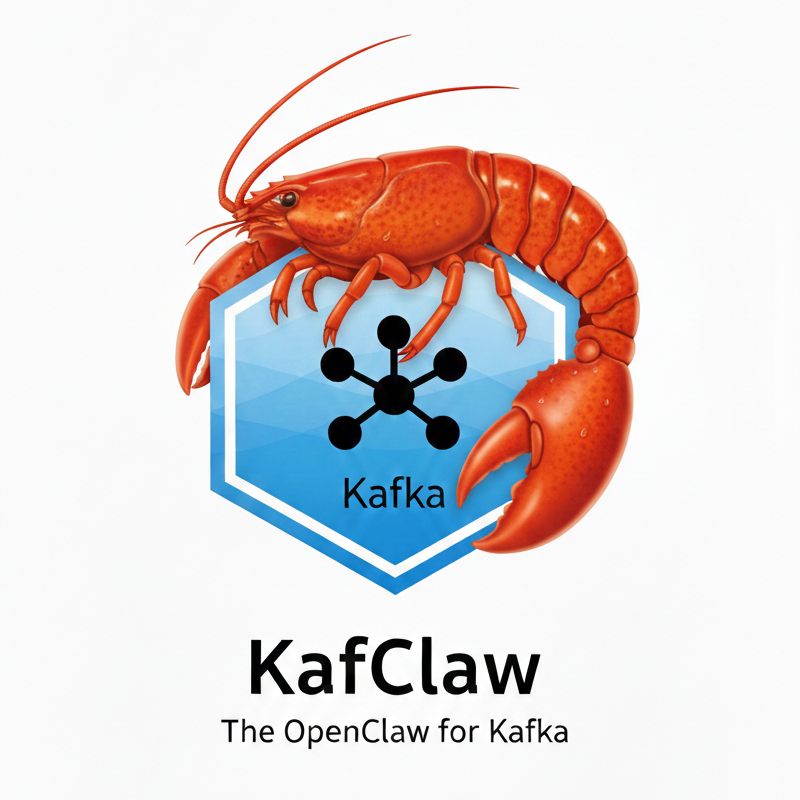

# KafClaw Documentation

  

KafClaw is a Go-based agent runtime with three practical deployment modes:

- `local`: personal assistant on one machine
- `local-kafka`: local runtime connected to Kafka/group orchestration
- `remote`: headless gateway reachable over network (token required)

## Start Here

- [Getting Started](./getting-started.md) - install, onboard, first run
- [Operations and Maintenance](./maintenance.md) - runbook for updates, checks, backups, troubleshooting

## Core References (v2)

- [User Manual](./v2/user-manual.md)
- [Operations Guide](./v2/operations-guide.md)
- [Admin Guide](./v2/admin-guide.md)
- [Architecture Overview](./v2/architecture.md)
- [Detailed Architecture](./v2/architecture-detailed.md)
- [Security Risks](./v2/security-risks.md)
- [Release Guide](./v2/release.md)

## Security Baseline

- Default bind is loopback: `127.0.0.1`
- Remote mode requires auth token
- Use `kafclaw doctor` for diagnostics
- Use `kafclaw doctor --fix` for env merge and permissions hygiene

## Repository Docs Areas

- `docs/v2/` - primary product and operations docs
- `docs/security/` - security audits and roadmap
- `docs/bugs/` - bug records
- `docs/tasklogs/` - implementation task logs
