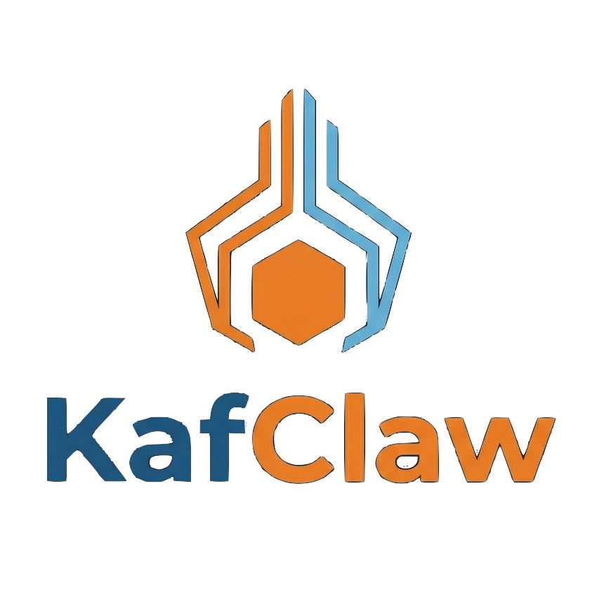

# KafClaw Documentation

  

KafClaw is a Go-based agent runtime with three practical deployment modes:

- `local`: personal assistant on one machine
- `local-kafka`: local runtime connected to Kafka/group orchestration
- `remote`: headless gateway reachable over network (token required)

## Ecosystem

- **KafScale** ([github.com/kafscale](https://github.com/kafscale), [kafscale.io](https://kafscale.io)): Kafka-compatible and S3-compatible data plane used for durable event transport and large artifact flows in agent systems.
- **GitClaw** (in this KafClaw repository): agentic, self-hosted GitHub replacement focused on autonomous repository workflows and automation.
- **Scalytics Copilot** ([github.com/scalytics/ScalyticsCopilot](https://github.com/scalytics/ScalyticsCopilot)): Apache 2.0-licensed open-source operations stack for private AI inference with open models, providing OpenAI-compatible APIs, hardware monitoring, and management for GenAI workloads.
- **KafClaw**: runtime and coordination layer for local, Kafka-connected, and remote/headless agents.

## Start Here

- [Getting Started](./start-here/)
- [User Manual](./start-here/user-manual/)

## Onboarding

- [Onboarding](./onboarding/)
- [Getting Started Guide](./start-here/getting-started/)
- [WhatsApp Onboarding](./integrations/whatsapp-onboarding/)
- [WhatsApp Setup](./integrations/whatsapp-setup/)

## Agent Concepts

- [Agent Concepts](./agent-concepts/)
- [How Agents Work](./agent-concepts/how-agents-work/)
- [Soul and Identity Files](./agent-concepts/soul-identity-tools/)
- [Runtime Tools and Capabilities](./agent-concepts/runtime-tools/)

## Memory Management

- [Memory Management](./memory-management/)
- [Memory Architecture and Notes](./agent-concepts/memory-notes/)
- [CoT Cascading Protocol](./agent-concepts/CoT/)
- [Memory Governance Operations](./memory-management/memory-governance-operations/)

## Communication and Channels

- [Communication and Channels](./collaboration/)
- [Group and Kafka Communication Operations](./collaboration/group-kafka-operations/)
- [Integrations](./integrations/)
- [Slack and Teams Bridge](./integrations/slack-teams-bridge/)

## Operations and Admin

- [Operations and Admin](./operations-admin/)
- [Manage KafClaw](./operations-admin/manage-kafclaw/)
- [Operations and Maintenance](./operations-admin/maintenance/)
- [Admin Guide](./operations-admin/admin-guide/)
- [Operations Guide](./operations-admin/operations-guide/)
- [Docker Deployment](./operations-admin/docker-deployment/)
- [Release Guide](./operations-admin/release/)
- [Example Deployment](./operations-admin/example/)

## Architecture and Security

- [Architecture and Security](./architecture-security/)
- [Security for Operators](./architecture-security/security-for-ops/)
- [Architecture Overview](./architecture-security/architecture/)
- [Detailed Architecture](./architecture-security/architecture-detailed/)
- [Timeline Architecture](./architecture-security/architecture-timeline/)
- [Security Risks](./architecture-security/security-risks/)
- [Subagents Threat Model](./architecture-security/subagents-threat-model/)

## Reference

- [Reference](./reference/)
- [CLI Reference](./reference/cli-reference/)
- [API Endpoints](./reference/api-endpoints/)
- [Configuration Keys](./reference/config-keys/)
- [Knowledge Contracts](./reference/knowledge-contracts/)
