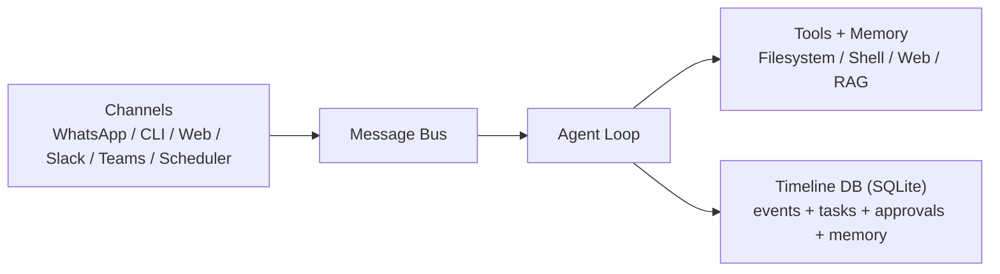

# KafClaw Architecture — Overview

A quick reference for the KafClaw system architecture. For the comprehensive deep-dive, see [architecture-detailed.md](./architecture-detailed.md).

> See also: [FR-009 System Architecture](../requirements/FR-009-system-architecture.md), [FR-013 Package Design](../requirements/FR-013-package-design.md)

---

## Component Overview

### 1. Core Agent Loop (`internal/agent`)

The heart of the system. Manages the state machine of a conversation:
- **Loop** — Orchestrates interaction between LLM and tools. Agentic loop runs up to 20 iterations per message.
- **Context Builder** — Dynamically assembles the system prompt from soul files, working memory, observations, skills, and RAG context.

### 2. Message Bus (`internal/bus`)

Asynchronous pub-sub decoupling channels from the agent loop:
- **Inbound** — Messages from the outside world (WhatsApp, CLI, Web UI, scheduler).
- **Outbound** — Responses from the agent delivered to channels.
- Buffered channels: 100 inbound, 100 outbound.

### 3. Channels (`internal/channels`)

Interface to the outside world:
- **WhatsApp** — Native Go via `whatsmeow`. No Node.js bridge required.
- **CLI** — Direct terminal interaction.
- **Web UI** — Browser-based chat via dashboard API.

### 4. Tool Framework (`internal/tools`)

The agent's capabilities, gated by a 3-tier policy engine:
- **Filesystem** — Read/write/edit with path safety (writes confined to work repo).
- **Shell** — Execute commands with deny-pattern filtering and strict allow-list.
- **Memory** — Remember/recall via semantic vector search.

### 5. Memory System (`internal/memory`)

6-layer semantic memory with vector embeddings:
- Soul files, conversations, tool results, group sharing, ER1 sync, observations.
- SQLite-vec backend (zero external dependencies).
- Working memory (per-user scratchpad) and observer (LLM compression).

### 6. Provider Layer (`internal/provider`)

LLM abstraction supporting OpenAI-compatible APIs:
- Chat completions, embeddings, transcription (Whisper), TTS.
- Default model: `anthropic/claude-sonnet-4-5` via OpenRouter.

---

## System Diagram

  <svg viewBox="0 0 1120 360" role="img" aria-label="KafClaw system diagram" style="min-width:900px;max-width:100%;height:auto;">
    <defs>
      <marker id="arrowA" markerWidth="9" markerHeight="7" refX="8" refY="3.5" orient="auto">
        <polygon points="0 0, 9 3.5, 0 7" fill="#2e5cab"></polygon>
      </marker>
    </defs>
    <rect x="410" y="40" width="300" height="64" rx="10" fill="#eaf1ff" stroke="#9bb5e6"></rect>
    <text x="560" y="65" text-anchor="middle" font-size="18" font-weight="700" fill="#1f3f84">Message Bus</text>
    <text x="560" y="84" text-anchor="middle" font-size="12" fill="#355d9c">Inbound / Outbound decoupling</text>

    <rect x="410" y="130" width="300" height="70" rx="10" fill="#ffffff" stroke="#d4dcec"></rect>
    <text x="560" y="157" text-anchor="middle" font-size="16" font-weight="700" fill="#24344d">Agent Loop</text>
    <text x="560" y="176" text-anchor="middle" font-size="12" fill="#4e5c73">LLM orchestration + tool loop</text>

    <rect x="120" y="48" width="190" height="140" rx="10" fill="#ffffff" stroke="#d4dcec"></rect>
    <text x="215" y="72" text-anchor="middle" font-size="14" font-weight="700" fill="#24344d">Channels</text>
    <text x="215" y="96" text-anchor="middle" font-size="12" fill="#4e5c73">WhatsApp</text>
    <text x="215" y="116" text-anchor="middle" font-size="12" fill="#4e5c73">CLI / Web UI</text>
    <text x="215" y="136" text-anchor="middle" font-size="12" fill="#4e5c73">Slack / Teams</text>
    <text x="215" y="156" text-anchor="middle" font-size="12" fill="#4e5c73">Scheduler</text>

    <rect x="790" y="48" width="220" height="152" rx="10" fill="#ffffff" stroke="#d4dcec"></rect>
    <text x="900" y="72" text-anchor="middle" font-size="14" font-weight="700" fill="#24344d">Tools + Memory</text>
    <text x="900" y="96" text-anchor="middle" font-size="12" fill="#4e5c73">Filesystem / Shell</text>
    <text x="900" y="116" text-anchor="middle" font-size="12" fill="#4e5c73">Web / Recall</text>
    <text x="900" y="136" text-anchor="middle" font-size="12" fill="#4e5c73">Working Memory</text>
    <text x="900" y="156" text-anchor="middle" font-size="12" fill="#4e5c73">Observer + RAG</text>
    <text x="900" y="176" text-anchor="middle" font-size="12" fill="#4e5c73">Group / Skills</text>

    <rect x="345" y="235" width="430" height="88" rx="10" fill="#f4f8ff" stroke="#c8d6f1"></rect>
    <text x="560" y="258" text-anchor="middle" font-size="14" font-weight="700" fill="#214483">Timeline DB (SQLite)</text>
    <text x="560" y="278" text-anchor="middle" font-size="12" fill="#4e5c73">Events • Tasks • Approvals • Memory chunks</text>
    <text x="560" y="297" text-anchor="middle" font-size="12" fill="#4e5c73">Group roster • Topics • Settings</text>

    <line x1="310" y1="98" x2="410" y2="72" stroke="#2e5cab" stroke-width="2.2" marker-end="url(#arrowA)"></line>
    <line x1="710" y1="72" x2="790" y2="98" stroke="#2e5cab" stroke-width="2.2" marker-end="url(#arrowA)"></line>
    <line x1="560" y1="104" x2="560" y2="130" stroke="#2e5cab" stroke-width="2.2" marker-end="url(#arrowA)"></line>
    <line x1="560" y1="200" x2="560" y2="235" stroke="#2e5cab" stroke-width="2.2" marker-end="url(#arrowA)"></line>
  </svg>

Mermaid source (GitHub code view renders this; GitHub Pages may require a Mermaid JS include depending on your theme setup):

## Design Principles

- **Message bus decoupling** — Channels never call the agent directly.
- **Graceful degradation** — Memory, group, orchestrator, ER1 are all optional.
- **Secure defaults** — Binds 127.0.0.1, tier-restricted tools, deny-pattern filtering.
- **Single SQLite database** — All persistent state in `~/.kafclaw/timeline.db`.
